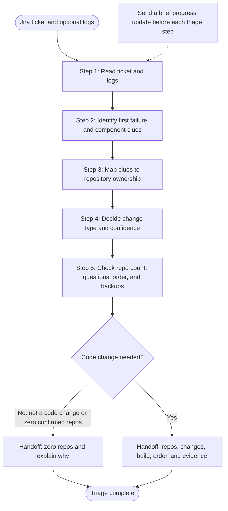
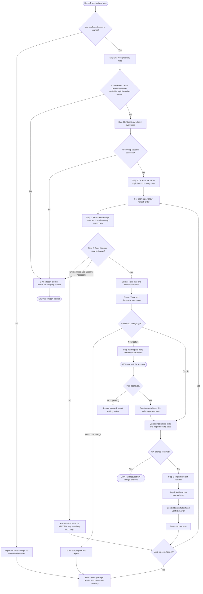

# Ticket Triage and Implementation Flow

This presentation view follows the two prompts: triage first, then implementation from the handoff. The prompt files remain the source of the detailed instructions and stop conditions.

## 1. Ticket Triage

## 2. Code Change From Handoff

Progress updates are emitted before and after steps, outside the final report. A feature plan and an API-change request are approval stops; neither proceeds to source edits until approved.